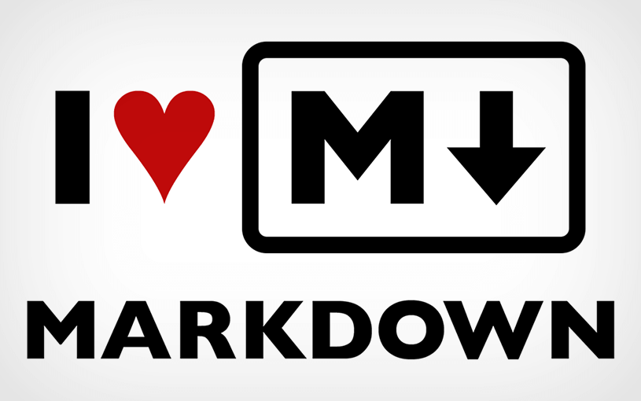

# Descrição do Curso de MarckDown



Markdown é uma linguagem de marcação que pode ser convertida para HTML. É bem simples de aprender, pois sua leitura e escrita são muito fáceis. Markdown é muito utilizada em documentação de software e é a linguagem oficial de documentação no GitHub.  

O objetivo do curso é apresentar Markdown como uma forma de melhorar a maneira como você documenta software.  
Aprenda tudo sobre Markdown em 35 minutos com um mini-curso gratuito de 14 vídeo-aulas. O curso aborda a sintaxe da linguagem com exemplos, mostra algumas dicas e truques para utilizar Markdown no GitHub e ao final apresenta um caso real de utilização da linguagem.  

**O que você aprenderá**  

* Aprender o que é e pra que serve Markdown
* Aprender a sintaxe da linguagem Markdown
* Adicionar os seguintes itens:
    * títulos
    * parágrafos
    * listas
    * imagens
    * links
    * tabelas
* Criar um README completo para seus projetos no * GitHub
* Aprender dicas e truques para serem utilizados no GitHub  

__Há algum requisito ou pré-requisito para o curso?__  

* Conhecimentos básicos em informática  

__Para quem é este curso:__  

1. Qualquer pessoa que queira aprender Markdown
2. Qualquer pessoa que queira melhorar seus conhecimentos em Markdown
10. Pessoas que queiram utilizar Markdown no GitHub, BitBucket, etc


***
***
***
```javascript
//Comentário
alert('ih rapaz ');

//váriaveis
var nomeVariavel;

var abobrinha = 1;
var texto = 'texto';
texto = 1;
```

        //Comentário
        alert('ih rapaz ');

        //váriaveis
        var nomeVariavel;

        var abobrinha = 1;
        var texto = 'texto';
        texto = 1;


|   nome   | idade | nascimento |
| -------  | :---: | ---------- |
| Vinicius |  18   | 06/12/2001 |
| Thiago   |  16   | 16/08/2003 |


[](https://www.sp.senac.br/jsp/default.jsp?newsID=0)

[Link com função][link-set]

[link-set]: https://github.com/vinicius-Sdr?tab=repositories

[Link para o meu perfil do Github](https://github.com/vinicius-Sdr?tab=repositories)


